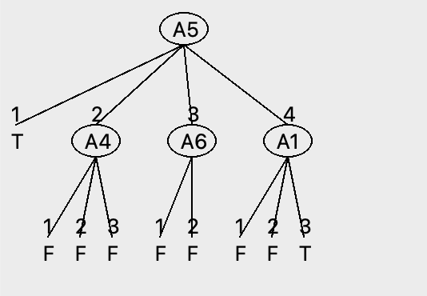

### ENV
python3 -m venv venv/
source venv/bin/activate
pip install -r requirements.txt


# Lab 1

Lab 1 decision trees

Author: Jesper Lindeberg, Linus Markström

Date: 27/1 - 2026

## Assignment 0

The hardest set to classify is MONK-2 since it can't be efficiently mapped by a decision tree whilst MONK-1 and MONK-3 can be. We need 2 element to exclusively be equal to 1 which is essentially the XOR problem, which is aknow hard problem for descision trees [scikit](https://scikit-learn.org/stable/modules/tree.html).

## Assignment 1

| Monk   | Entropy            |
| ------ | ------------------ |
| MONK 1 | 1                  |
| MONK 2 | 0.957117428264771  |
| MONK 3 | 0.9998061328047111 |

## Assignment 2

high entropy = low predictability
low entropy = high predictability

In uniform distribution, all cases has an equal probability, this makes it hard to predict the outcome. This will result in a low predictability and therefore a high entropy. In non-uniform distributions, some cases will have higher chance of happening, which result in a possibility to predict these higher probable outcomes. Therefore, a non-uniform distribution is more predicable and will result in low entropy.

An example for a high entropy would be a fair die. Whilst an example of a distribution with low entropy would be a normal gaussian distribution.

## Assignment 3

| Dataset | a1     | a2     | a3     | a4     | a5     | a6     |
| ------- | ------ | ------ | ------ | ------ | ------ | ------ |
| Monk-1  | 0.0753 | 0.0058 | 0.0047 | 0.0263 | 0.287  | 0.0008 |
| Monk-2  | 0.0038 | 0.0025 | 0.0011 | 0.0157 | 0.0173 | 0.0062 |
| Monk-3  | 0.0071 | 0.2937 | 0.0008 | 0.0029 | 0.2559 | 0.0071 |

Monk 1: Max attribute 5 gain: 0.287

Monk 2: Max attribute 5 gain: 0.0173

Monk 3: Max attribute 2 gain: 0.2937

For Monk 1 we choose attribute 5, for Monk 2 attribute 5 and for Monk 3 attribute 2. This based on the information gain, which these attributes maximizes.

## Assignement 4

When the information gain is maximized, the entropy for the subset $S_k$ is low compared to the entropy of the current node. 

This means when maximizing the information gain we are searching for the path (subset) which gives us the largest difference in entropy, meaning that we choose to enter the path which gives us the highest amount of predictability for future guesses. We're actively minimizing the entropy by maximizing the gain in each tree node. This is preciesly why it's a good heuristic. It locally searches for the best path down the decision tree which is the attribute we want to choose.

## Assignment 5

### Manual tree vs buildTreee()
Split 1: Attribute 5

Max gain for value 1: attribute 1

Max gain for value 2: attribute 4

Max gain for value 3: attribute 6

Max gain for value 4: attribute 1

So for the value 1 node, we should select attribute 1, for value node 2 attribute 4, for value node 3 attribute 6 and for value node 4 attribute 1.

```console
Max for sample 1: attribute 1
Majority class for sample 1: True
Max for sample 2: attribute 4
Majority class for sample 2: False
Max for sample 3: attribute 6
Majority class for sample 3: False
Max for sample 4: attribute 1
Majority class for sample 4: False
```



### Using buildTree()

| Monk   | $E_{train}$ | $E_{test}$          |
| ------ | ----------- | ------------------- |
| MONK 1 | 1.0         |  0.8287037037037037 |
| MONK 2 | 1.0         | 0.6921296296296297  | 
| MONK 3 | 1.0         | 0.9444444444444444  |

As our hypthesis in **Assignment 0**, the Monk 2 will be the hardest problem for a descision tree algorithm to solve which aligns with the test performance shown above. 

It also shows that the build tree can correctly map all of the training data which is why its accuracy is 100%.

## Assignemnt 6

By pruning we will remove one or more nodes in the tree, this will decrease the varaince of the results. This will according to the bias-variance trade-off lead to increased bias, making the training more generlised for the validation and testing data. However, it still tells that the model has something "wrong" since bias indicates that we need to adjust for something which necessarily isn't there, it's a value we've created to adjust to the uncertainity in the model. 
 
## Assignment 7


