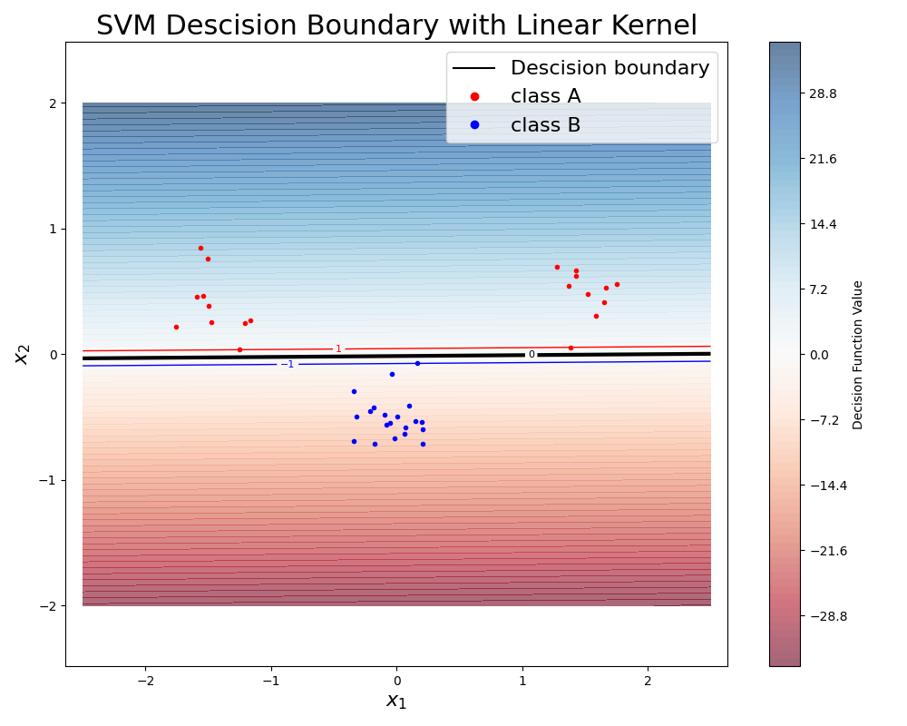
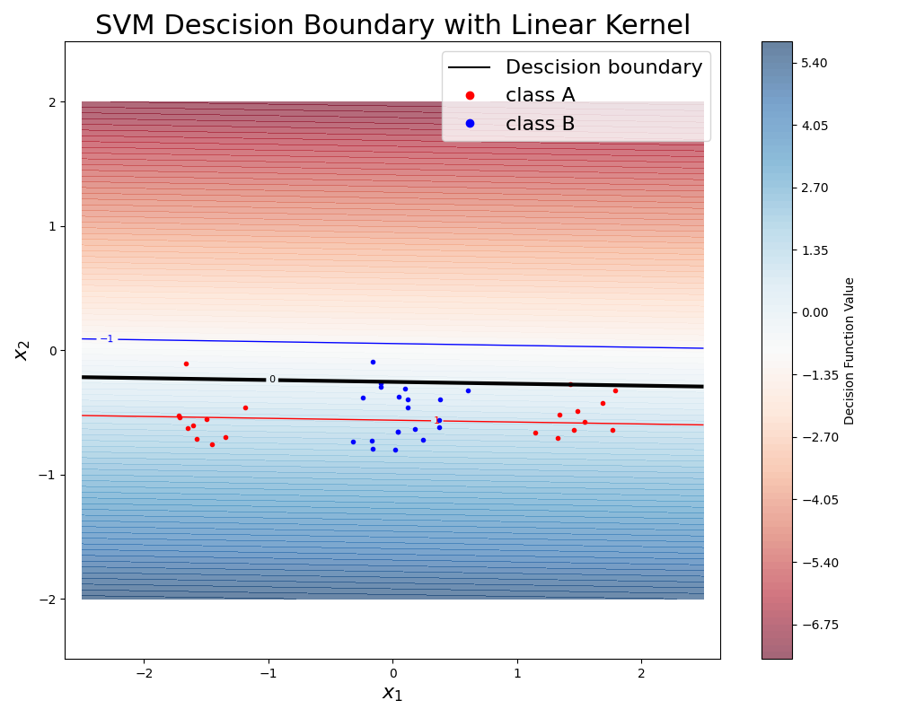
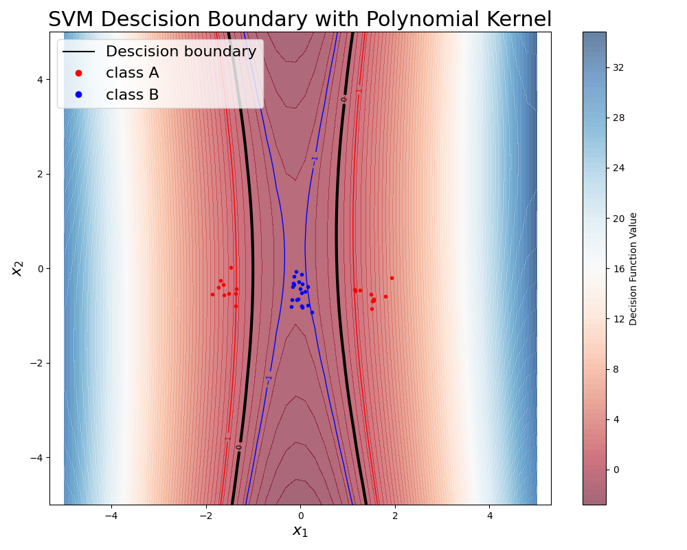
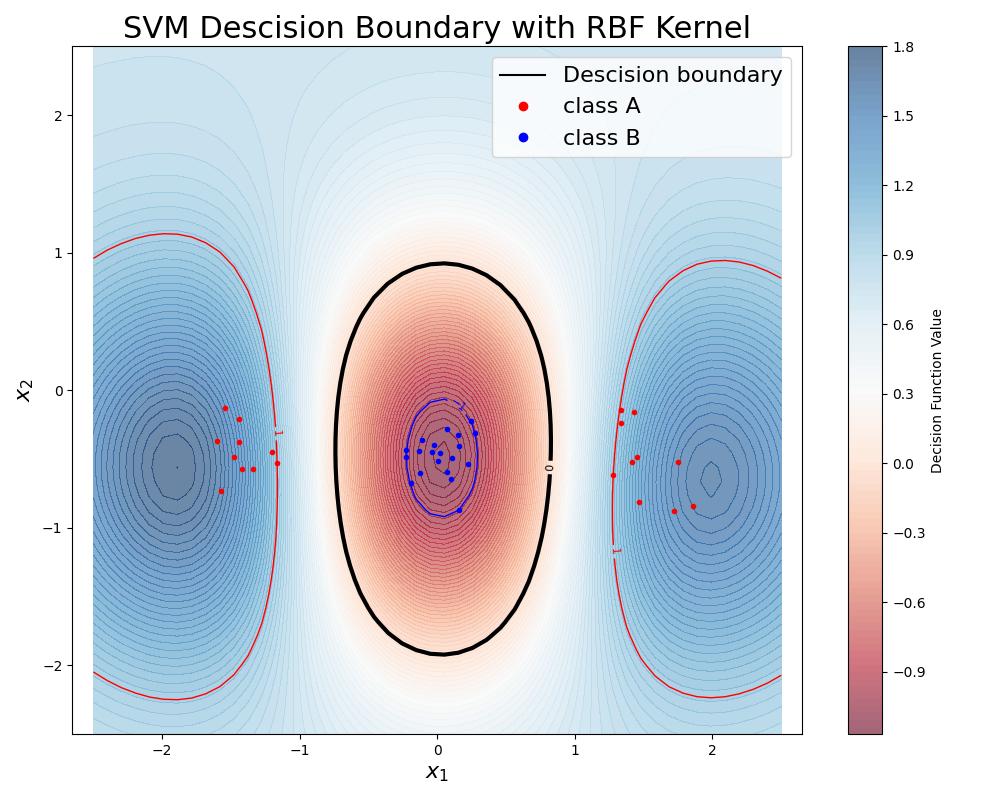
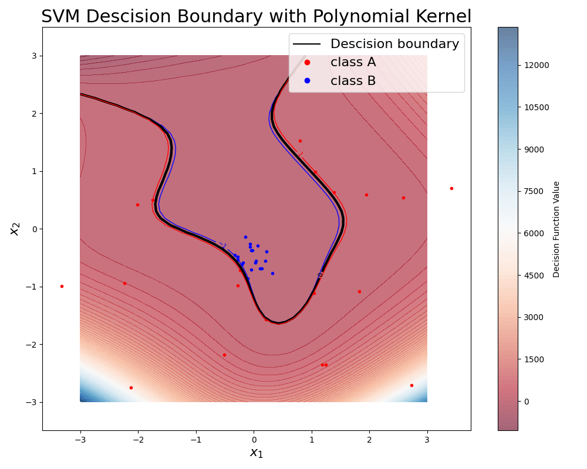
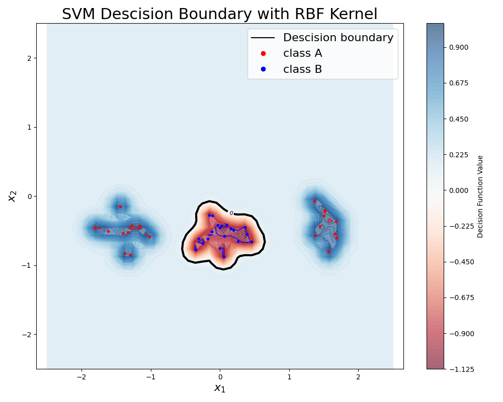

# Lab 2

## Question 1 (Linear kernel)

The optimizer (minimize func) is not able to find a solution when the two classes are not linearly seperable. As can be seen in the images below:

Here a solution is found, as the data is linearly seprarable.

Here no solution is found, as the data is not linearly seperable.

## Question 2 (Non-linear kernel)

squared poly kernel and RBF kernel with $\sigma = 1.0$

## Question 3 (Paremters)

For the poly kernel increasing the polynomial changes increases the complexity of the descison space (boundary). This means that we are effectively increasing the features the and shapes the SVM can become. This means that we're more prone to overfitting to the specific points. Which in short means we have a high variance but low bias. 

high degree = low bias, high variance
low degree = high bias, low variance

Polynomial kernel with grad=7

The same is true for the RBF but in the opposite direction. By allowing for smaller sigma we decrease the variance and get a tigher bound which is more prone to overfit the data points, as a wider variance will smooth the classification leading to more generlized result. 

High sigma = high bias, low variance
low sigma = low bias, high variance

RBF kernel with variance=5:

## Question 4 (C penelty term)

C sets the bounds for the resulting alpha values. A lower C value means that the model is more lenient towards noisy data whilst a high C value is more restricting and does not allow for as much slack. This means that for noisy data a low C value is optimal. For non noisy data a high C value is more optimal.

## Question 5 ()

You would like to match the selection of model (kernel) i.e. RBF, polynomial or linear based on the data. For complex data (more features/classes) this tend to result in more complex models. If the data is more noisy, the best option would instead be to allow more slack, which will result in more generalisation. Otherwise, we could overfit on the noise if we just increase the model complexity.