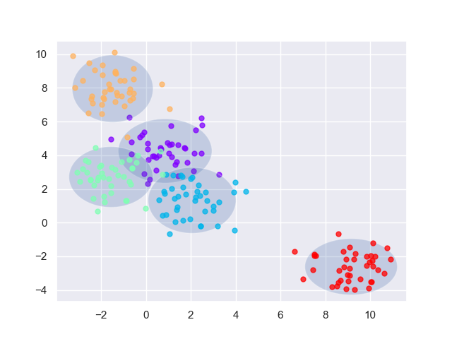
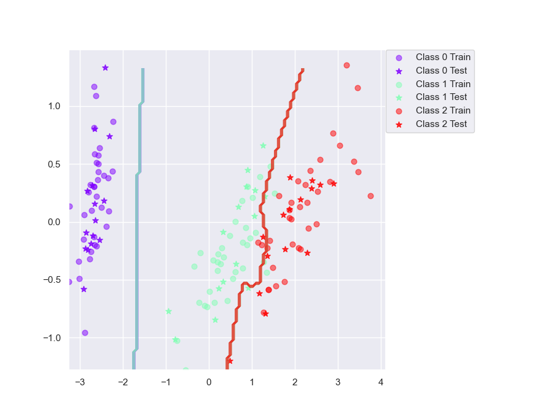
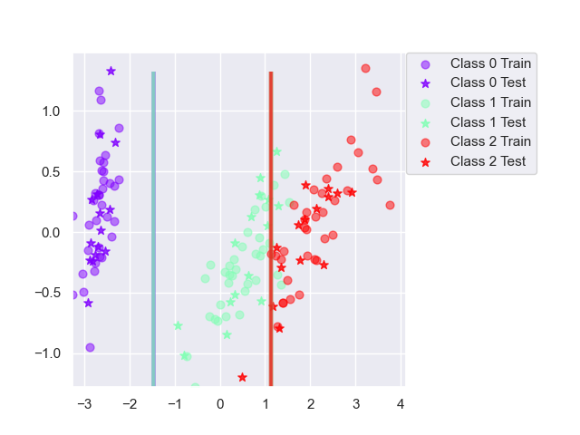
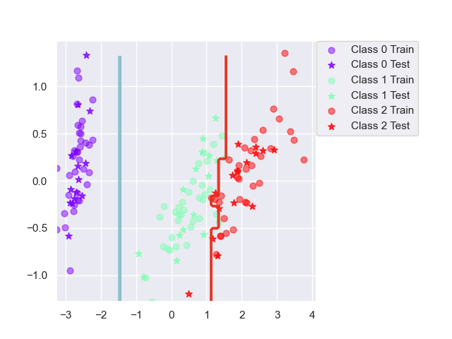

# Lab 3

Authors: Jesper Lindeberg, Linus Markström

Date: 20/2 - 2026

## Assignment 1

Guassian plot for the ML parameter calculations, visualising the mean and variance of the classes.

## Assigment 2

This question can't be answered, since it's just code implementation.

## Assignment 3

The Iris dataset performs really well, while the Vowel dataset performs less impresive.

| Dataset | Accuracy |
| ------- | -------- |
| Iris    | 89 %     |
| Vowel   | 64.7 %   |

The images below display the estimated decision boundry from the trained bayesian classifiers. The poor performance of the Vowel dataset could be due to the high amount of classes.

### 1) When can a feature independence assumption be reasonable and when not?

For example in cases of high-dimension datasets (more features than samples), for catogorical features or text classification (treat as independat, when actually not).

### 2) How does the decision boundary look for the Iris dataset? How could one improve the classification results for this scenario by changing classifier or, alternatively, manipulating the data?

We could optimize the classifier by using the non-naive bayes classifier meaning we don't assume independence between the classes and account for possible dependence between them.

However, a non-naive bayesian classifier, General Bayesian Classifier, is more computationally heavy requires more data to see possible dependence between classes.

## Assignment 4

Same as assignment 2, only code implementation.

## Assignment 5

### 5.1 Classification accuracy

| Dataset | Accuracy (no boost) | Accuracy (Adaboost) |
| ------- | ------------------- | ------------------- |
| Iris    | 89.0 %              | 94.7 %              |
| Vowel   | 64.7 %              | 80.2 %              |

Huge performance improvement using AdaBoost and 10 classifiers. We get the improvement since we're training alphas which say how much impact each classifier have in the total vote. This means that we some of the classifiers which are more general will weigh more heavily whilst more fine grained classifiers with lower alpha will help make fine adjustments so that the decision boundary gets more precise.

### 5.2 Descision boundary

The decision boundry is noticably sharper, especially where the clusters are more intertwined and closely togehter and not as linearly seperable.

Images can be seen below (IRIS dataset):

|             Single Classifier Bayes             |              AdaBoost Classifier Bayes              |
| :---------------------------------------------: | :-------------------------------------------------: |
|  |  |

### 5.3 Make up for basic classifier

Yes, the more basic classifiers, learn from each other, trains on missclassified data more using weighted distributions, resulting in mulitple weak learners with high variance. The final classifiers get weighted votes depedning on performance, resulting in a weighted summed vote, with lower error than for a single classifier.

## Assignment 6

### 6.1 Classification accuracy DecisionTree

| Dataset | Accuracy (no boost) | Accuracy (Adaboost) |
| ------- | ------------------- | ------------------- |
| Iris    | 92.4 %              | 94.6 %              |
| Vowel   | 64.1 %              | 86.4 %              |

For the Iris dataset the decision tree is already good, without boosting, but gets slightly better with it. This is because boosting allows the decision tree to utilize more fine grained control for edge case tests which allows it to "curve" its decision boundary (step-wise). This is because adaboost allows us to have several trees which can control specific features and creates the observed staircase effect (further explained in next section).

Similarly, we can observe a drastic improvement for the Vowel dataset which can be attributed to the more fine grained control which adaboost gives us. The more drastic improvement in this case is likely due to Vowels having more classes which a single tree has difficulty representing.

### 5.2 Descision boundary

The decision boundry on the single classifier is observed as straight line due to the fundamental design of the descion tree, as it splits the data based on its continoues values in the input space. When using AdaBoost we observe a step-wise descion boundary
which is due to multiple trees combined uing weighted performance. This results in a improved performance, but as the performance is initialy quite high, we do not see a huge improvement.

Images can be seen below (IRIS dataset):

|               Single Classifier DT                |                   AdaBoost Classifier DT                    |
| :-----------------------------------------------: | :---------------------------------------------------------: |
|  |  |

### 5.3 Make up for basic classifier

Yes, this is most notable when having more classes which a single tree as trubles solving. By using multiple tree classifiers, the perfomance can be notably improved.

## Assignment 7

In regard to our results we noticed that, in general, decision trees produced better results, especially the boosted variants. The initial non boosted trees also outperform non-boosted naive bayes classifier. Since a lot of factors such as outliers, irrelevant inputs etc can affect the performance.

The table below explain which model variant is superior in regards to the listed properties :

1 = Best score

4 = Worst performance in category

| Criteria                                   | Naive Bayes                                 | Boosted Naive Bayes                                 | Decision Tree                                                        | Boosted Decision Trees                   |
| :----------------------------------------- | :------------------------------------------ | :-------------------------------------------------- | :------------------------------------------------------------------- | :--------------------------------------- |
| **Outliers**                               | 3                                           | 4 (Affects mean heavily)                            | 2                                                                    | 1 (Based on gain)                        |
| **Irrelevant Inputs (Unrelated features)** | 4 (Features equally important)              | 3                                                   | 2                                                                    | 1 (Based on gain)                        |
| **Predictive Power**                       | 4 (Assume independancy)                     | 3 (Lowers bias)                                     | 2                                                                    | 1 (Removes high variance in single tree) |
| **Mixed Data Types**                       | 4 (Different distributions)                 | 3                                                   | 2 (handles out of the box, branches can handle different categories) | 1 (improved variant)                     |
| **Scalability (N & D)**                    | 1 (ND) (low complexity and scales linearly) | 2 (M\*ND) (low complexity, added sequential voting) | 3 (DNlog(N)) (higher complexity)                                     | 4 (M\*DNlog(N)) (self explanatory)       |

Given this table it can be observed that boosted decision trees win in every category, except for scalability. In most of the cases where performance, in terms of computational efficency, is not considered, a boosted decision tree has the highest chance of producing the best generalisation of the 4 tested variants.

