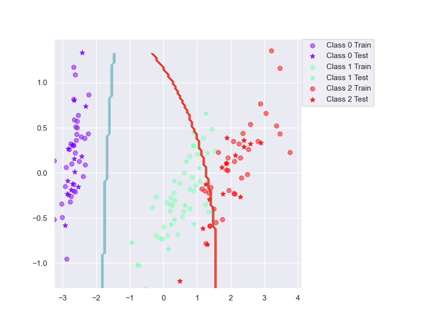
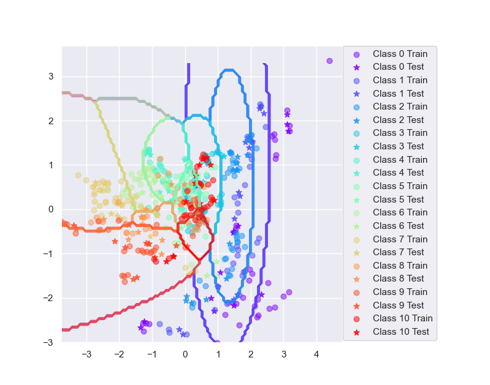

# Lab 3

Authors: Jesper Lindeberg, Linus Markström

Date: Today :D

## Assignment 3
The Iris dataset performs really well, while the Vowel dataset performs less impresive.

| Dataset   | Accuracy |
| --------- | ---------|
| Iris      | 89 %     |
| Vowel     | 64.7 %   |

The images below display the estimated decision boundry from the trained bayesian classifiers. The poor performance of the Vowel dataset could be due to the high amount of classes.
 

